# Uplifted Mascot - Technical Documentation

This directory contains the technical implementation guides for the Uplifted Mascot system, broken down into 5 major components.

## System Architecture

```mermaid
%%{init: {'theme':'base', 'themeVariables': {'primaryColor':'#fff', 'primaryTextColor':'#000', 'primaryBorderColor':'#333', 'lineColor':'#666'}}}%%
flowchart TB
    subgraph SOURCE["📚 Knowledge Base"]
        GitRepo["📦 GitHub Repository<br/>(Markdown Docs)"]
    end
    
    subgraph CI["🔄 CI/CD Pipeline (Jenkins)"]
        IngestionJob["📥 Ingestion Job<br/>(on Git push)"]
        BuildJob["🔨 Build Job<br/>(on code change)"]
        
        IngestionJob -->|1. Clone repo| ProcessDocs["⚙️ Process Docs<br/>(chunking)"]
        ProcessDocs -->|2. Create embeddings| VertexEmbed["🔤 Vertex AI<br/>Embeddings API"]
        VertexEmbed -->|3. Load into| ChromaDBService
        
        BuildJob -->|Build & push| GAR["📦 GAR<br/>(Artifact Registry)"]
    end
    
    subgraph K8S["☸️ Kubernetes Cluster"]
        ChromaDBService["💾 ChromaDB Service"]
        RAGService["🎭 RAG Service<br/>(FastAPI)"]
        Frontend["🌐 Frontend<br/>(Nginx)"]
        Ingress["🔀 Ingress<br/>(HTTPS)"]
        PVC["💿 PVC<br/>(ChromaDB data)"]
        
        ChromaDBService -.->|Persistent storage| PVC
    end
    
    subgraph AI["🤖 AI Services (GCP)"]
        VertexEmbed
        Gemini["✨ Gemini API<br/>(LLM)"]
    end
    
    subgraph USER["👤 Users"]
        WebUser["🌐 Web Browser"]
        GameUser["🎮 In-Game Client"]
    end
    
    %% Ingestion flow (blue, dashed)
    GitRepo -.->|git push triggers| IngestionJob
    ChromaDBService -.->|stores| PVC
    
    %% Build flow (green)
    BuildJob --> GAR
    GAR -->|deploy| RAGService
    
    %% Query flow (orange)
    WebUser -->|HTTPS| Ingress
    GameUser -->|API| Ingress
    Ingress --> Frontend
    Frontend -->|/api/*| RAGService
    
    RAGService -->|1. Embed question| VertexEmbed
    RAGService -->|2. Query vectors| ChromaDBService
    ChromaDBService -->|3. Top-K chunks| RAGService
    RAGService -->|4. Generate answer| Gemini
    Gemini -->|5. Response| RAGService
    RAGService -->|JSON| Frontend
    Frontend -->|HTML| Ingress
    Ingress -->|HTTPS| WebUser
    Ingress -->|API| GameUser
    
    %% Styling
    classDef source fill:#e3f2fd,stroke:#1976d2
    classDef cicd fill:#f3e5f5,stroke:#7b1fa2
    classDef k8s fill:#e8f5e9,stroke:#388e3c
    classDef ai fill:#fff3e0,stroke:#f57c00
    classDef user fill:#fce4ec,stroke:#c2185b
    
    class GitRepo source
    class IngestionJob,BuildJob,ProcessDocs cicd
    class ChromaDBService,RAGService,Frontend,Ingress,PVC k8s
    class VertexEmbed,Gemini ai
    class WebUser,GameUser user
```



## Quick Start

For a complete manual workflow from GitHub to working website:

1. **Knowledge Base** (`01-knowledge-base.md`) - Set up your GitHub repository
2. **Ingestion** (`02-ingestion.md`) - Process markdown files and create embeddings
3. **Vector Storage** (`03-vector-storage.md`) - Load embeddings into ChromaDB (free, local) or Vertex AI Vector Search (for scaling)
4. **RAG Service** (`04-rag-service.md`) - Build and deploy the API endpoint
5. **Frontend** (`05-frontend.md`) - Create the web interface

## Documentation Structure

### 01-knowledge-base.md
- Setting up GitHub repositories
- File structure and organization
- Manual repository cloning and validation
- Multiple repository support

### 02-ingestion.md
- Document processing and chunking
- Creating embeddings with Vertex AI
- Python scripts for processing
- Manual workflow commands

### 03-vector-storage.md
- **ChromaDB setup** (recommended - free, local, zero cost)
- Loading embeddings into ChromaDB
- Vertex AI Vector Search (optional, for scaling to large datasets)
- Cost comparison and recommendations

### 04-rag-service.md
- FastAPI service implementation
- Local development setup
- GKE deployment
- API endpoints and testing

### 05-frontend.md
- HTML/CSS/JavaScript chat interface
- Embeddable widget version
- Deployment options (GitHub Pages, GCS, etc.)
- Customization guide

## Prerequisites

Before starting, ensure you have:

- **GCP Account**: With Vertex AI API enabled
- **Google Cloud SDK**: `gcloud` CLI installed
- **Python 3.9+**: For processing scripts
- **Git**: For repository access
- **Basic Terminal Skills**: For running commands

## Manual Workflow Summary

```bash
# 1. Setup environment
python3 -m venv venv
source venv/bin/activate  # On Windows: venv\Scripts\activate
cd scripts
pip install -r requirements.txt
cd ../rag-service
pip install -r requirements.txt

# 2. Authenticate
gcloud auth application-default login
export GCP_PROJECT_ID="your-project-id"
# On Windows:
set GCP_PROJECT_ID=your-project-id

# 3. Process documents (see 01 & 02)
git clone https://github.com/your-org/your-repo.git
cd scripts
python process_docs.py ../your-repo chunks.json
python create_embeddings.py chunks.json embeddings-array.json

# 4. Setup vector storage (see 03) - ChromaDB (recommended)
# From workspace root:
python scripts/load_chromadb.py scripts/embeddings-array.json
# Or use Vertex AI Vector Search for scaling (see 03-vector-storage.md)

# 5. Deploy RAG service (see 04)
cd ../rag-service
python rag_service.py  # Local testing
# Or deploy to GKE

# 6. Create frontend (see 05)
cd ../frontend
# Edit HTML, test locally, deploy
```

## Cost Estimation

**With ChromaDB (Recommended - Free!):**
- **Vector Storage**: $0/month (runs locally)
- **Embedding Creation**: ~$0.10 per 1000 chunks (one-time, using Vertex AI)
- **Query Operations**: ~$0.001-0.002 per question (Gemini API)
- **Total**: Essentially free for development and small-scale use!

**With Vertex AI Vector Search (For Scaling):**
- **Vector Storage**: $72+/month (depending on machine type)
- **Embedding Creation**: ~$0.10 per 1000 chunks
- **Query Operations**: ~$0.10 per 1K queries
- **Best for**: Large datasets (100K+ documents) or production scaling

**Recommendation**: Start with ChromaDB. It's free, fast for small datasets, and runs locally. Only move to Vertex AI Vector Search if you need to scale beyond ChromaDB's capabilities.

## Next Steps

1. Start with `01-knowledge-base.md` to set up your repository
2. Follow each guide sequentially
3. Test each component before moving to the next
4. Once working manually, consider automating with Jenkins (future)

## Getting Help

- Check troubleshooting sections in each document
- Verify GCP authentication and API enablement
- Ensure all environment variables are set correctly
- Review error messages in service logs

## Additional Resources

- **Jenkins CI/CD**: See `JENKINS.md` for automated deployment setup
- **Kubernetes Deployment**: See `k8s/README.md` for detailed K8s deployment guide

