# The "Uplifted Mascot" AI Core

## Overview & Vision

The "Uplifted Mascot" (UM) is an AI-powered knowledge and mentorship platform. It provides a single, consistent, and friendly chat interface based on a mascot (e.g., "Gooey" for https://terasology.org, "Bill" for https://demicracy.org) to introduce a project in a light-hearted fashion despite depth and broad objectives.

Its primary goal is to **scale developer enablement and community engagement** in the age of AI, serving as a 24/7 "AI Mentor" that makes massive, complex projects (like Demicracy or Bifrost) approachable for everyone.

## Core Architecture: RAG on GKE

The UM is a **Retrieval-Augmented Generation (RAG)** service built on Google Cloud, designed to be flexible and multi-tenant (i.e., it can serve multiple mascots and projects from one core infrastructure).

```mermaid
%%{init: {'theme':'base', 'themeVariables': {'primaryColor':'#fff', 'primaryTextColor':'#000', 'primaryBorderColor':'#333', 'lineColor':'#666'}}}%%
flowchart LR
    subgraph COL1["📚 Knowledge Base<br/>(Source Code & Docs)"]
        direction TB
        GitRepo["📦 Git Repository<br/>(Markdown Docs)"]
        MarkdownFiles["📄 Markdown Files<br/>(Design Docs, Specs)"]
        Chunking["⚙️ Chunking &<br/>Formatting<br/>(on GKE)"]
        
        GitRepo --> Chunking
        MarkdownFiles --> Chunking
    end
    
    subgraph COL2["🔧 CI/CD & Ingestion Pipeline<br/>(on GKE)"]
        direction TB
        Jenkins["🔧 Jenkins Pipeline<br/>(Triggered on git push)"]
        PythonScript["🐍 Python Script<br/>Document Processor"]
        TextChunks["📚 Text Chunks<br/>(Semantic Paragraphs)"]
        EmbedService["🔤 Vertex AI<br/>Embeddings Service"]
        
        Jenkins -->|git pull| PythonScript
        PythonScript -->|1. Chunk docs| TextChunks
        TextChunks -->|2. Embed chunks| EmbedService
    end
    
    subgraph COL3["🧠 Mascot's Brain Database"]
        direction TB
        VectorDB["💾 Vertex AI<br/>Vector Search<br/>(Long-term Memory)"]
    end
    
    subgraph COL4["🎭 Mascot's Voice<br/>(RAG Service on GKE)"]
        direction TB
        RAGService["⚙️ Gooey/Bill<br/>RAG Service<br/>(Flask/FastAPI)"]
        PersonaConfig["👤 Persona Config<br/>(personas.json)"]
        GeminiLLM["✨ Vertex AI<br/>Gemini (LLM)"]
        
        RAGService -->|Load persona| PersonaConfig
        RAGService -->|4. Generate| GeminiLLM
        GeminiLLM -->|5. Stream answer| RAGService
    end
    
    subgraph COL5["🌐 User Frontends"]
        direction TB
        WebUI["🌐 Web Frontend<br/>(Chat Widget)"]
        InGameJS["💬 In-Game<br/>(JS/HTML Chat Widget)"]
        InGameMod["🎮 In-Game Frontend<br/>(Terasology/DestSol/<br/>Minecraft Mod)"]
    end
    
    %% Ingestion Flow (Blue arrows - left to right)
    Chunking -.->|"git push triggers"| Jenkins
    EmbedService -->|"3. Store vectors<br/>(Calls Vertex AI<br/>Embeddings API)"| VectorDB
    
    %% Query Flow (Green arrows for requests, Orange for responses)
    WebUI -->|"Query + Persona"| RAGService
    InGameJS -->|"Query + Persona"| RAGService
    InGameMod -->|"Query + Persona"| RAGService
    
    RAGService -->|"1. Embed question"| EmbedService
    EmbedService -.->|"2. Query vectors"| VectorDB
    VectorDB -->|"3. Top 5 chunks<br/>(Retrieval)"| RAGService
    
    RAGService -->|"AI-Generated<br/>Response"| WebUI
    RAGService -->|"AI-Generated<br/>Response"| InGameJS
    RAGService -->|"AI-Generated<br/>Response"| InGameMod
    
    %% Arrow styling - colored lines for cross-column flows
    %% Count internal links first (0-7), then cross-column links (8+)
    %% Blue (#4285f4): Ingestion flow
    %% Green (#34a853): Query requests  
    %% Orange (#ff9800): Responses
    linkStyle 8 stroke:#4285f4,stroke-width:3px,stroke-dasharray: 5 5
    linkStyle 9 stroke:#4285f4,stroke-width:3px
    linkStyle 10 stroke:#34a853,stroke-width:3px
    linkStyle 11 stroke:#34a853,stroke-width:3px
    linkStyle 12 stroke:#34a853,stroke-width:3px
    linkStyle 13 stroke:#34a853,stroke-width:3px
    linkStyle 14 stroke:#34a853,stroke-width:3px,stroke-dasharray: 5 5
    linkStyle 15 stroke:#34a853,stroke-width:3px
    linkStyle 16 stroke:#ff9800,stroke-width:3px
    linkStyle 17 stroke:#ff9800,stroke-width:3px
    linkStyle 18 stroke:#ff9800,stroke-width:3px
```



### Components:

1.  **Knowledge Base (Git Repository):**
    * **What:** A Git repo containing all project documentation (design docs, specs, `CONTRIBUTING.md` guides, API references) as Markdown files.
    * **Why:** This is the "single source of truth." It's version-controlled and familiar to developers.

2.  **Ingestion Pipeline (Jenkins + Vertex AI):**
    * **What:** A Jenkins pipeline (running on GKE) that triggers on every `git push` to the docs repo and runs a Python script.
    * **Process:**
        1.  `git pull` the latest docs.
        2.  **Chunk:** Break docs into small, semantic paragraphs.
        3.  **Embed:** Call the **Vertex AI Embeddings API** for each chunk to convert it into a vector.
        4.  **Store:** Save these vectors in the "Mascot's Brain."
    * **Why:** This ensures the mascot's knowledge is always up-to-date with the latest design changes, automatically. Depending on frequency of updates and cost of processing it might make sense as an on-demand or nightly job.

3.  **Mascot's Brain (Vertex AI Vector Search):**
    * **What:** A managed vector database.
    * **Why:** This is the mascot's "long-term memory." It allows for incredibly fast and accurate retrieval of the *most relevant* document chunks related to a user's question.

4.  **Mascot's Voice (RAG Service on GKE):**
    * **What:** A simple Python (Flask/FastAPI) web service deployed on your GKE cluster. This is the single API endpoint for all frontends.
    * **Process (on query):**
        1.  **Receive Request:** Gets a JSON payload: `{ "question": "...", "persona": "gooey" }`
        2.  **Embed Question:** Calls **Vertex AI Embeddings API**.
        3.  **Retrieve Context:** Queries **Vertex AI Vector Search** to get the "Top 5" most relevant doc chunks.
        4.  **Augment & Generate:** Sends a prompt to the **Vertex AI Gemini API** containing:
            * The retrieved context (the supposed "truth").
            * The user's question.
            * The "persona" instructions (see below).
        5.  **Return Response:** Streams the generated answer back to the user.

## The "Persona" System: How One Core Serves All

The RAG Service will load a "persona" configuration based on the `persona` field in the request. This allows for infinite mascots.

**`personas.json` (example):**

```json
{
  "gooey": {
    "system_prompt": "You are Gooey, the helpful and friendly gelatinous cube mascot for Terasology. You are quirky, encouraging, and love to help new contributors. Your goal is to make complex topics simple and fun. Always answer using ONLY the provided context."
  },
  "bill": {
    "system_prompt": "You are Bill, the learned pig mascot for Demicracy. You are thoughtful, precise, and an expert on federated governance. You answer questions about the Demicracy design spec with clarity and detail. Always answer using ONLY the provided context."
  }
}
```

## Use case: Project Introduction

It used to be that a "splash page" would be enough to give a first impression for a given project. But what if you also had a simple chat box to ask questions about the project, with answers well-grounded in up-to-date actual documentation?

This is particularly valuable for really deep and otherwise potentially opaque systems like highly detailed design documentation not yet digested into more workable chunks.

## Use case: The AI-Powered Developer Enablement Experience

The 24/7 Onboarding Mentor: A new contributor doesn't need to wait for a human. Their first experience is a chat widget on the website:

"Hi Gooey! I'm new. How do I set up my developer environment?"

"What's a 'good first issue' for someone who knows Java but not ECS?"

"Can you explain what the 'JEP Tiers' mean?"

Previously the Terasology community developed https://github.com/MovingBlocks/AdventureSite which was a similar concept but with a manual approach using forked conversational paths on a static site.

Now we live in the age of AI, for better or worse.

### Discord variant

Rather than just a text box on a website this should be entirely workable as a hook for a Discord chatbot or similar.

## Use case: In-Game "Just-in-Time" Learning

 The in-game mascot (Gooey NPC) can call the same API. A player who gets stuck can ask:

"Gooey, I'm trying to a thing. Where do I start?"

Gooey (powered by the RAG pipeline) can respond with instructions from within crafting system documentation, tutorials, or literal recipes sourced right from game assets.

## Use case: Easy First Issue

For projects desiring to expand contributions a time-consuming preparation activity is simply making enough newbie-approachable tasks.

Basic AI assistance already can help augment this if an experienced project member knows of some desired tasks and just needs help turning those approachable and well-documented for a new contributor.

A new way to generate tasks will be described in the JEP Workflow where the mascot is the "friendly face" of the automated task system, helping users find and understand tasks generated by the platform.